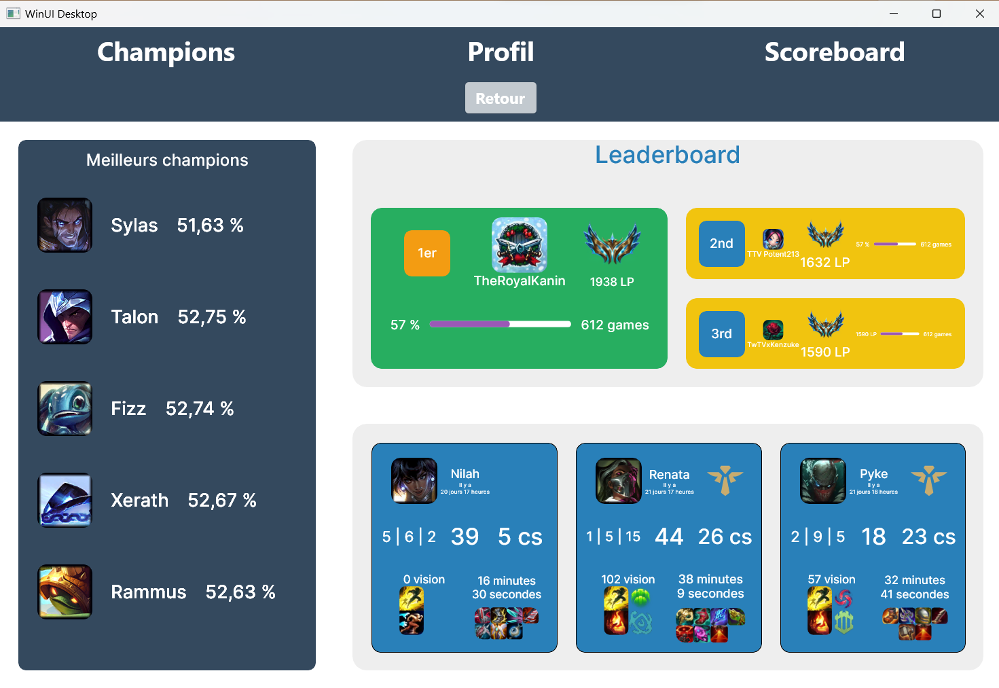

# Nexus Client

Nexus Client is a new OpenSource solution to check your data about League of Legends

## Installation

To collaborate, you need .NET and Visual Studio with these elements:

- .NET development Desktop
- Development for the universal Windows platform
- [Last version of Camille](https://github.com/MingweiSamuel/Camille)
- [Last release of LiveCharts2](https://github.com/beto-rodriguez/LiveCharts2)
- [Last release of Newtonsoft.Json](https://github.com/JamesNK/Newtonsoft.Json)

## Contributing

Pull requests are welcome. For major changes, please open an issue first
to discuss what you would like to change.

Please make sure to update tests as appropriate.

## Goals

Trying to make this software optimized and simple.